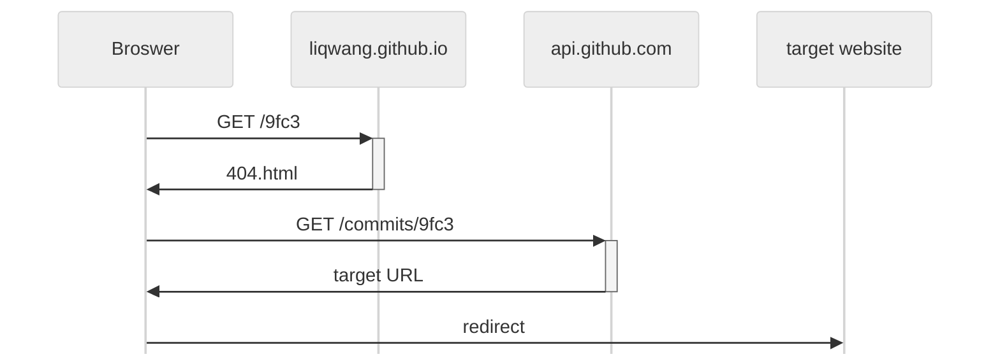

# link
Use Git commit message to store the short URL on GitHub, host the redirector on [GitHub Pages](https://docs.github.com/en/pages)

This interesting tool is from the article: https://www.v2ex.com/t/1105845

## How it works?

The [GitHub API](https://docs.github.com/en/rest/commits/commits#get-a-commit) currently(2025.2.1) allows the request to specify the Git commit in two simpler ways than the full SHA-1 hash `9fc3741bbf92219dd53278f447e124d2d3fdf5df`:
- use the SHA-1 hash prefix(at least 4 characters)  
  eg: https://liqwang.github.io/link/9fc3
  > ⚠️ The 4-prefix may not work when the commit count of a repo exceeds a certain condition, for example:  
  > Git commit: https://github.com/microsoft/vscode/commit/92f0b764f84bb5c4c5495266e12fca80e47bba86  
  > ❌(4-prefix) https://api.github.com/repos/microsoft/vscode/commits/92f0  
  > ✔️(7-prefix) https://api.github.com/repos/microsoft/vscode/commits/92f0b76
- use custom tag name of the Git commit  
  eg: https://liqwang.github.io/link/bitcoin-3b1b

It's impossible to redirect the short URL using `index.html` on GitHub Pages, because it only serves the root path `/`, other requests will response `404.html`

## TODO
- [ ] Use [IndexedDB](https://developer.mozilla.org/en-US/docs/Web/API/IndexedDB_API/Using_IndexedDB) or [localStorage](https://developer.mozilla.org/en-US/docs/Web/API/Window/localStorage) to cache the target URL in the client browser, which can reduce the invocations of GitHub API
